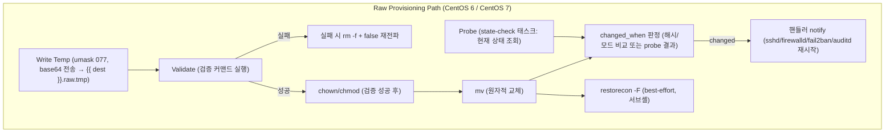

# 5. Raw Provisioning Path 설계: CentOS 6/7 레거시 타겟을 위한 `ansible.builtin.raw` 기반 프로비저닝

- **Status**: Accepted
- **Date**: 2026-09-22
- **Deciders**: Overseer Engineering Team & User
- **Context**: CentOS 6/7 레거시 타겟 대상 `roles/common` + `roles/security` 프로비저닝 (AnsiballZ 미지원 환경)

---

## 1. Context & Problem Statement

CentOS 6/7 타겟은 Python 3.7+ 인터프리터가 없어 ansible-core의 AnsiballZ 모듈 래퍼가 모든 표준 모듈 호출에서 SyntaxError를 발생시킵니다. 사실 조사(Fact Gathering)의 암묵적 `setup` 호출조차 예외가 아니며, 어떠한 `when:` 게이팅보다도 먼저 실패합니다. 이 한계를 우회하기 위해 `ansible.builtin.raw`를 직접 구동하여 AnsiballZ를 완전히 우회하는 **Raw Provisioning Path**를 설계했습니다. 범위는 `roles/common` + `roles/security`이며 `roles/docker_engine`은 제외합니다(`CONTEXT.md` 정의). 이 ADR이 다루는 것은 실제 구현이 아닌 설계 그 자체이며, 다음 네 가지 핵심 의사결정이 필요했습니다:

1. **멱등성 보존을 위한 sentinel 계약**: `raw` 모듈은 항상 `changed: true`를 보고하므로, 이 스위트의 멱등성 보장을 어떻게 유지할 것인가.
2. **module `validate:` 절의 대체**: raw 태스크가 module의 `validate:`/`atomic_move` 안전장치 없이 파일을 안전하게 기록하려면 어떤 헬퍼가 필요한가.
3. **태스크 인벤토리**: `roles/common` + `roles/security` 중 실제로 CentOS 6/7에서 raw로 재작성해야 하는 태스크가 무엇인가.
4. **`--check` 모드 지원 여부**: dry-run 가시성을 어느 수준까지 지원할 것인가.

---

## 2. Decision Outcomes (결정 사항)

### 2.1 Changed/Unchanged Sentinel 계약

태스크 종류에 따라 sentinel 메커니즘을 이원화합니다.

- **상태 확인형(state-check) 태스크**: 기존 `SEC-006-IFACE-CLI-PROBE`/`SEC-006-IFACE-CLI` 패턴을 그대로 미러링하는 2-태스크 probe+mutate 구조를 사용합니다. 별도 프로브 태스크가 현재 상태를 조회하고, 뒤따르는 mutate 태스크가 그 결과를 `changed_when` 조건으로 사용합니다.
- **콘텐츠 배포형(content-push) 태스크**: 로컬에서 계산한 콘텐츠 해시를 원격의 `sha256sum` 결과 및 파일 모드(`stat`)와 비교하여, `changed_when` = 해시 불일치 OR 모드 불일치로 판정합니다. 별도의 마커 파일은 두지 않습니다.
- **최초 프로비저닝(파일 부재) 케이스**: 양쪽 probe 모두 `failed_when: false`를 페어링하고 등록된 stdout을 `| default('')`로 읽습니다. 대상 파일이 아직 없는 최초 프로비저닝 시점에는 `sha256sum`/`stat`가 빈 문자열을 반환하며, 빈 문자열은 실제 기대 해시/모드와 결코 같을 수 없으므로 별도의 예외 처리 없이 OR 조건이 자연스럽게 `changed`로 판정됩니다.

### 2.2 Write-Temp/Validate/Move 헬퍼

module의 `validate:` 절과 `atomic_move`를 대체하는 표준 헬퍼 시퀀스는 다음과 같습니다.

1. 고정 임시 경로 `{{ dest }}.raw.tmp`(대상과 동일 디렉터리 — 원자적 `mv` 보장)를 사용합니다.
2. 기록 전 `umask 077`을 적용합니다.
3. 콘텐츠는 heredoc이 아닌 unwrapped base64로 전달합니다.
4. `chown`/`chmod`는 검증 성공 이후, `mv` 직전으로 이동시켜 노출 창(exposure window)을 최소화합니다.
5. 검증 실패 시 임시 파일을 정리하고 `{ rm -f ...; false; }`로 실패를 재전파합니다(단순 `||`만으로는 실패가 가려질 수 있음).
6. `mv` 이후 best-effort `restorecon -F`를 서브셸로 그룹핑하여 실행합니다(성공/실패 판정에 영향을 주지 않도록). 이는 module 기반 `atomic_move`의 SELinux 재라벨링을 대체하는 조치로, 이 raw 경로의 대상 호스트는 `major_version >= 7` 게이팅된 `SEC-011`(module 기반)의 혜택을 받을 수 없기 때문입니다.

헬퍼의 형태는 CentOS 6/7 분기 전체에서 동일하며, 검증 커맨드와 대상 모드만 태스크별로 달라집니다.

이 헬퍼가 실제로 대체해야 하는 `validate:` 절 소비자는 다음 세 태스크로 확정되었습니다(모두 CentOS 6/7 양쪽에서 실행): `SEC-001`(`lineinfile`, `validate: '/usr/sbin/sshd -t -f %s'`), `SEC-014`(`copy`, `validate: 'visudo -cf %s'`), `COMMON-014`(`copy`, `validate: 'visudo -cf %s'`).

### 2.3 CentOS 6/7 태스크 인벤토리 및 구조적 배치

**구조적 배치**: raw 태스크는 별도 role로 분리하지 않고, 기존 `roles/common`/`roles/security` 파일에 **인라인으로** 추가합니다. 이는 이 스위트가 이미 채택하고 있는 `major_version` 분기 컨벤션(예: `COMMON-009`의 chrony/ntpd 분기)을 그대로 따르는 것입니다. 나아가 CentOS 6과 CentOS 7은 **서로 다른 두 개의 raw 경로**로 명시적으로 분리합니다 — 하나의 공유 경로가 아니라, 기존 코드 자체의 분기 방식(NTP의 chrony vs ntpd, 방화벽의 firewalld vs iptables)을 그대로 미러링합니다.

이 배치 원칙 아래, CentOS 6과 CentOS 7은 하나의 태스크 집합이 아니라 서로 다른 두 세트로 취급합니다.

- **CentOS 7**: firewalld 블록 전체(~30개 태스크) + CentOS 6에는 없는 `common` 태스크 5개(`COMMON-001`/`004`/`008`/`009` + `COMMON-017`).
  - `COMMON-017`(journald 보존 설정)은 `major_version` 기반이 아니라 `ansible_service_mgr == "systemd"`로 게이팅되어 있어, CentOS 6(Upstart)을 별도 표기 없이 암묵적으로 제외합니다. `major_version` 분기표만 보면 놓치기 쉬운 숨은 분기이므로 별도로 명시합니다.
- **CentOS 6**: 고유 태스크는 iptables 페어(`SEC-008`/`SEC-021`)와 NTP(`COMMON-010`)뿐입니다.
- 계정, sysctl, SSH 하드닝, fail2ban, Auditd, sudoers는 양쪽 모두에서 동일하게 실행됩니다.

이 조사는 또한 helper/sentinel 결정이 커버해야 할 `validate:` 및 non-`ansible.builtin` 모듈 태스크 집합을 확정했고, 사실 조사(암묵적 `setup` 호출) 자체가 raw 기반 대응이 필요한 첫 번째 지점임을 확인했습니다. non-`ansible.builtin` 모듈 계열은 양쪽 공통(`ansible.posix.sysctl`/`authorized_key`, `community.general.pam_limits`)과 CentOS 7 전용(`community.general.timezone`, `ansible.posix.selinux`, `ansible.posix.firewalld`)으로 나뉩니다.

### 2.4 `--check` 모드 지원 방침

**Option A**를 채택합니다: raw 태스크는 `--check` 아래에서 자연스럽게 스킵되며, `check_mode: false`나 `ansible_check_mode` 가드를 별도로 두지 않습니다. 2.1/2.2에서 결정된 sentinel 계약과 헬퍼 설계는 이 결정으로 인해 변경되지 않습니다.

현재 인벤토리(`ns0266`, `ns0332`)에는 실제 CentOS 6/7 호스트가 없어 dry-run 가시성 손실이 당장의 리스크는 아니지만, 실제 CentOS 6/7 호스트가 프로비저닝되는 시점에 재검토가 필요한 사항으로 기록합니다(§4 참고).

---

## 3. Architecture Overview

---

## 4. Consequences & Trade-offs

- **장점 (Pros)**:
  - AnsiballZ 의존 없이 CentOS 6/7 타겟에서도 `roles/common` + `roles/security`의 멱등성 보장을 그대로 유지합니다.
  - 헬퍼 형태(write-temp/validate/move)가 CentOS 6/7 분기 전체에서 동일하여 유지보수 부담이 적습니다.
  - 기존 probe+mutate 컨벤션(`SEC-006-IFACE-CLI-PROBE`/`SEC-006-IFACE-CLI`)을 재사용해 설계 일관성을 확보했습니다.
- **고려사항 (Cons & Mitigations)**:
  - CentOS 6/7의 raw 태스크는 `--check` 모드에서 dry-run 가시성이 전혀 없습니다(Option A). 현재는 실제 CentOS 6/7 호스트가 인벤토리에 없어 리스크가 없지만, 실제 호스트가 프로비저닝되면 재검토가 필요합니다.
  - raw 경로의 대상 호스트는 `SEC-011`(`major_version >= 7` 게이팅, module 기반 SELinux 재라벨링)의 혜택을 받지 못하므로, `restorecon -F` best-effort 호출로 보완합니다 — 완전한 대체는 아닙니다.
  - `roles/access_security`로의 범위 확장 여부는 이 ADR의 범위 밖입니다. `CONTEXT.md`의 Raw Provisioning Path 정의를 다시 그려야 하는 질문이므로, 이 맵을 재개하는 것이 아니라 향후 별도의 새 효과(effort)에서 다뤄야 합니다.
